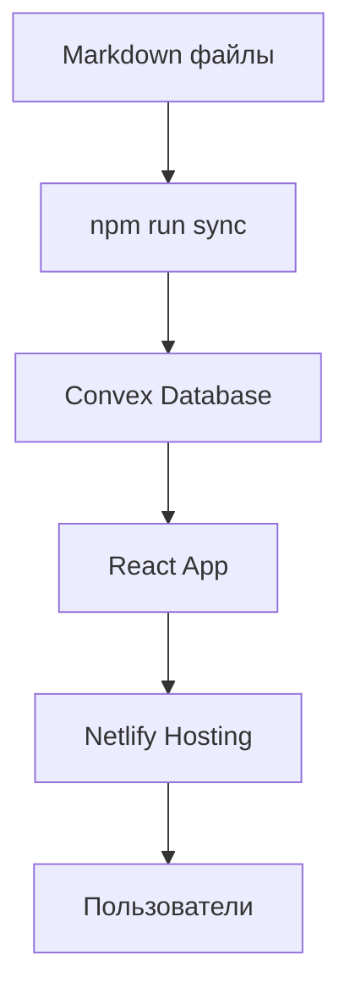

# Полное руководство по markdown-site

> Подробное руководство по использованию markdown-site фреймворка для создания блогов

---
Type: post
Date: 2025-01-19
Reading time: 8 мин чтения
Tags: руководство, markdown, блог, convex, netlify
---

# Полное руководство по markdown-site

Markdown-site — это современный фреймворк для создания блогов, который объединяет простоту markdown с мощью real-time технологий.

## Основные преимущества

### 🚀 Мгновенная публикация
- Написал пост → запустил `npm run sync` → пост на сайте
- Никаких ожиданий сборки или деплоя
- Real-time обновления во всех открытых браузерах

### 📝 Простота написания
- Обычный markdown без сложных конфигураций
- Frontmatter для метаданных
- Поддержка кода с подсветкой синтаксиса

### 🔧 Современный стек
- **React 18** + **TypeScript** для фронтенда
- **Convex** для real-time базы данных
- **Netlify** для хостинга
- **Vite** для быстрой разработки

## Архитектура системы



## Структура проекта

```
markdown-site/
├── content/
│   ├── blog/          # Посты блога
│   └── pages/         # Статические страницы
├── src/
│   ├── components/    # React компоненты
│   ├── pages/         # Страницы приложения
│   └── lib/           # Утилиты
├── convex/            # Convex функции
├── scripts/           # Скрипты синхронизации
└── public/            # Статические файлы
```

## Создание постов

### Базовый пост

```markdown
---
title: "Заголовок поста"
description: "Описание для SEO"
date: "2025-01-19"
slug: "url-posta"
published: true
tags: ["тег1", "тег2"]
readTime: "5 мин чтения"
---

# Заголовок поста

Содержимое поста...
```

### Расширенные опции frontmatter

```yaml
---
# Основные поля
title: "Заголовок"
description: "Описание"
date: "2025-01-19"
slug: "url"
published: true
tags: ["тег1", "тег2"]

# Дополнительные поля
readTime: "5 мин"
featured: true
featuredOrder: 1
excerpt: "Краткое описание"
image: "/images/post-image.jpg"
showImageAtTop: true

# Макет и навигация
layout: "sidebar"
docsSection: true
docsSectionGroup: "Группа"
docsSectionOrder: 1

# Автор
authorName: "Имя автора"
authorImage: "/images/author.jpg"
---
```

## Команды синхронизации

### Разработка
```bash
# Синхронизация постов
npm run sync

# Синхронизация discovery файлов
npm run sync:discovery

# Все вместе
npm run sync:all
```

### Продакшн
```bash
# Синхронизация постов в продакшн
npm run sync:prod

# Синхронизация discovery файлов в продакшн
npm run sync:discovery:prod

# Все вместе в продакшн
npm run sync:all:prod
```

## Работа с изображениями

### Размещение изображений
Поместите изображения в папку `public/images/`:

```
public/
└── images/
    ├── posts/
    ├── authors/
    └── logos/
```

### Использование в постах
```markdown

```

### Open Graph изображения
```yaml
---
image: "/images/posts/og-image.jpg"
showImageAtTop: true
---
```

## Настройка сайта

Основные настройки находятся в `src/pages/Home.tsx`:

```typescript
const siteConfig = {
  name: "Название сайта",
  title: "Подзаголовок",
  
  // Режим отображения featured секции
  featuredViewMode: "cards", // 'list' или 'cards'
  showViewToggle: true,
  
  // Галерея логотипов
  logoGallery: {
    enabled: true,
    images: [
      { src: "/images/logos/logo1.svg", href: "https://example.com" },
    ],
    position: "above-footer",
    speed: 30,
    title: "Нам доверяют",
  },
};
```

## Развертывание

### Локальная разработка

1. Клонируйте репозиторий:
```bash
git clone https://github.com/waynesutton/markdown-site.git
cd markdown-site
```

2. Установите зависимости:
```bash
npm install
```

3. Инициализируйте Convex:
```bash
npx convex dev
```

4. Запустите dev сервер:
```bash
npm run dev
```

### Продакшн на Netlify

1. Разверните Convex функции:
```bash
npx convex deploy
```

2. Подключите репозиторий к Netlify

3. Настройте переменные окружения:
   - `CONVEX_DEPLOY_KEY`
   - `VITE_CONVEX_URL`

4. Настройте команду сборки:
```
npm ci --include=dev && npx convex deploy --cmd 'npm run build'
```

## Дополнительные возможности

### Поиск
Фреймворк поддерживает полнотекстовый поиск и семантический поиск (требует OpenAI API ключ).

### Аналитика
Встроенная система аналитики для отслеживания посещений и популярных постов.

### Newsletter
Интеграция с AgentMail для рассылки новостей.

### MCP Server
Поддержка Model Context Protocol для интеграции с AI инструментами.

## Советы и лучшие практики

### Организация контента
- Используйте понятные slug'и
- Группируйте посты по тегам
- Добавляйте readTime для лучшего UX

### SEO оптимизация
- Заполняйте description для каждого поста
- Используйте изображения для Open Graph
- Структурируйте контент с заголовками

### Производительность
- Оптимизируйте изображения
- Используйте семантический поиск для больших блогов
- Регулярно обновляйте зависимости

## Заключение

Markdown-site предоставляет идеальный баланс между простотой использования и мощными возможностями. Вы можете сосредоточиться на написании контента, а фреймворк позаботится о технической стороне.

Начните с простого поста, а затем постепенно изучайте дополнительные возможности по мере необходимости.